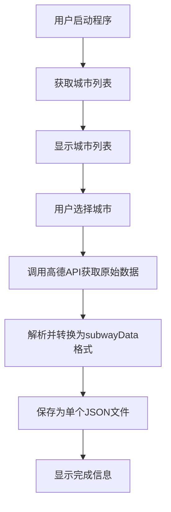

# 地铁线路数据爬虫 - 实施计划

## 项目概述

本项目旨在实现一个高德地图地铁数据爬虫工具，支持从高德地图API获取地铁线路和站点数据，并输出为单个JSON文件。

**技术栈**:
- Python 3.8+
- requests库（HTTP请求）
- json标准库（数据解析）
- PyInstaller（打包工具）

---

## 输出数据格式

参考 `subwayData.js` 的格式，输出为单个JSON文件：

```json
[
  {
    "name": "1号线",
    "id": 1,
    "coords": [
      [经度1, 纬度1],
      [经度2, 纬度2],
      ...
    ],
    "lineStyle": {
      "normal": {
        "color": "#0077c9"
      }
    },
    "station": [
      {
        "name": "站点名称",
        "isHC": false,
        "geo": [经度, 纬度]
      },
      {
        "name": "换乘站名称",
        "isHC": true,
        "geo": [经度, 纬度],
        "geo1": [经度, 纬度]  // 换乘站第二条线路的坐标
      },
      ...
    ]
  },
  ...
]
```

**字段说明**:
| 字段 | 类型 | 说明 |
|-----|------|------|
| `name` | string | 线路名称 |
| `id` | number | 线路ID |
| `coords` | array | 线路坐标点数组 |
| `lineStyle.normal.color` | string | 线路颜色（十六进制） |
| `station[].name` | string | 站点名称 |
| `station[].isHC` | boolean | 是否为换乘站 |
| `station[].geo` | array | 站点坐标 [经度, 纬度] |
| `station[].geo1` | array | 换乘站第二条线路坐标（可选） |

---

## 系统架构



---

## 模块设计

### 项目目录结构

```
MetroInfoCrawler/
├── src/
│   ├── __init__.py
│   ├── main.py              # 程序入口，CLI界面
│   ├── crawler.py           # 爬虫核心逻辑
│   ├── data_parser.py       # 数据解析/格式转换模块
│   └── utils.py             # 工具函数
├── output/                  # 数据输出目录
├── docs/
│   └── 需求文档.md
├── plans/
│   └── plan.md
├── subwayData.js            # 输出格式参考
├── requirements.txt
└── README.md
```

### 模块职责

| 模块 | 职责 |
|-----|------|
| `main.py` | 程序入口，处理CLI交互逻辑 |
| `crawler.py` | 封装HTTP请求，调用API获取原始数据 |
| `data_parser.py` | 将高德API原始数据转换为subwayData.js格式 |
| `utils.py` | 工具函数，包括异常处理、重试机制 |

---

## 详细实施步骤

### 1. 创建项目结构

- [ ] 创建 `src/` 目录
- [ ] 创建 `output/` 目录
- [ ] 创建 `src/__init__.py`

### 2. 创建依赖文件

创建 `requirements.txt`:
```txt
requests>=2.28.0
pyinstaller>=5.0.0
```

### 3. 实现工具模块

**`utils.py`** - 包含:
- HTTP请求头配置（User-Agent、Referer等）
- 安全请求函数 `safe_request()` 带重试机制
- 异常类定义（NetworkError、DataParseError等）
- 请求频率控制（1秒间隔）

### 4. 实现爬虫核心模块

**`crawler.py`** - 包含:
- `MetroCrawler` 类
- `__init__()` 初始化会话和请求头
- `get_city_list()` 获取城市列表
- `get_metro_data(city_code, city_pinyin)` 获取原始地铁数据
- `save_data(data, filename)` 保存JSON数据

### 5. 实现数据解析模块

**`data_parser.py`** - 包含:
- `DataParser` 类
- 核心方法：`convert_to_subway_format(raw_data)` 将高德API原始数据转换为subwayData.js格式
- 提取线路坐标点 `extract_coords()`
- 提取线路样式 `extract_line_style()`
- 提取站点信息 `extract_stations()`
- 处理换乘站 `handle_transfer_stations()`

### 6. 实现CLI界面

**`main.py`** - 包含:
- 主函数 `main()`
- 欢迎界面
- 调用城市管理模块
- 调用爬虫模块获取原始数据
- 调用解析模块转换格式
- 保存结果并显示完成信息

### 7. 测试和验证

- [ ] 测试城市列表获取
- [ ] 测试单个城市数据爬取
- [ ] 验证JSON输出格式符合subwayData.js规范
- [ ] 测试异常处理（网络超时、无效城市等）

## 打包部署

### Conda 环境配置

使用 Conda 环境：`dicom`

### 打包命令

```bash
# 激活conda环境
conda activate dicom

# 安装依赖
pip install -r requirements.txt

# 打包为单文件 exe
pyinstaller --onefile --name MetroCrawler --icon=icon.ico src/main.py
```

---

## API接口说明

### 城市列表接口
- **URL**: `https://map.amap.com/service/subway?_时间戳&srhdata=citylist.json`
- **方法**: GET
- **响应格式**:
```json
{"citylist": [{"spell": "beijing", "adcode": "1100", "cityname": "北京市"}, ...]}
```

### 城市地铁数据接口
- **URL**: `https://map.amap.com/service/subway?_时间戳&srhdata={adcode}_drw_{spell}.json`
- **方法**: GET
- **示例**: `https://map.amap.com/service/subway?srhdata=1100_drw_beijing.json`
- **响应格式**:
```json
{
  "s": "北京市地铁",
  "i": "1100",
  "l": [
    {
      "ln": "1号线",
      "st": [{"n": "苹果园", "sl": "116.178,39.925", "t": "1"}, ...],
      "c": ["861 852", "862 853", ...],
      "cl": "#C23A30",
      "ls": "线路ID"
    }
  ]
}
```

**字段映射说明**:
| 高德字段 | 说明 | 转换目标 |
|---------|------|---------|
| `ln` | 线路名称 | `name` |
| `ls` | 线路ID | `id` |
| `c` | 像素坐标数组 | 需转换为经纬度坐标 |
| `cl` | 线路颜色 | `lineStyle.normal.color` |
| `st[].n` | 站点名称 | `station[].name` |
| `st[].sl` | 站点经纬度 | `station[].geo` |
| `st[].t` | 是否换乘站 | `station[].isHC` |

---

## 异常处理策略

| 异常类型 | 处理策略 |
|---------|---------|
| 网络连接失败 | 提示检查网络，支持重试 |
| 请求超时 | 自动重试最多3次 |
| 城市编码无效 | 提示用户重新选择 |
| JSON解析失败 | 记录错误日志，跳过当前数据 |
| 文件写入失败 | 检查权限，尝试备用路径 |

---

## 输出文件名规则

```
{城市名称}_subway.json
```

示例：
- `北京_subway.json`
- `上海_subway.json`

---

## 版本记录

| 版本 | 日期 | 更新内容 |
|-----|------|---------|
| v1.0 | 2026-01-06 | 初始版本，支持单城市数据下载，输出subwayData.js格式 |

---

**计划创建时间**: 2026-01-06
**最后更新**: 2026-01-06 - 调整输出格式为subwayData.js标准
